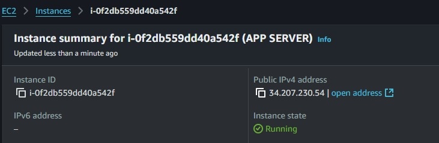
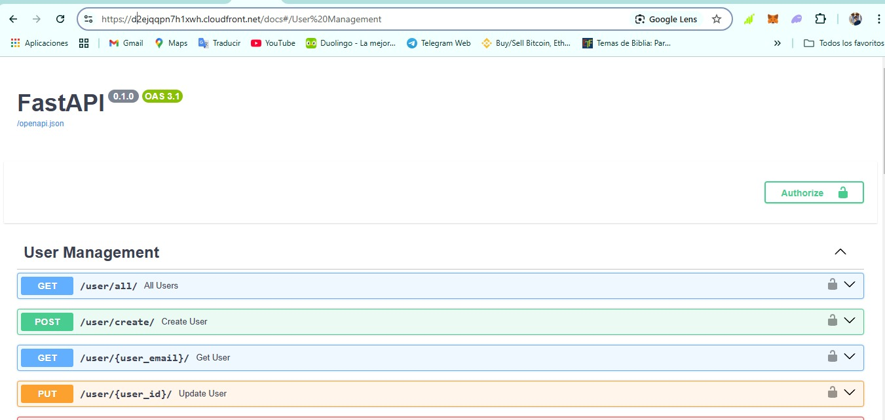

# PROYECTO DE INFRAESTRUCTURA PARA TI

## Integrantes

- [Michael Andrés Taboada Naranjo](https://github.com/MichaelTaboada2003) - T00064965
- [Neyan Manuel Montes Abad](https://github.com/XNeyMo) - T00064020

## Indice

1. [Introducción](#introducción)
2. [Diagrama de Arquitectura](#diagrama-de-arquitectura)
3. [Pre-requisitos](#pre-requisitos)
4. [Pasos para la Preparación](#pasos-para-la-preparación)
5. [Información Adicional](#información-adicional)

## Introducción

Este proyecto tiene como objetivo principal diseñar, configurar y desplegar automáticamente la infraestructura necesaria para un proyecto existente llamado **[LIAV](https://github.com/XNeyMo/liav)**. Este proyecto consta de tres componentes principales:

- **Frontend:** Aplicación web que interactúa con los usuarios.
- **Backend:** API que gestiona la lógica de negocio.
- **Base de datos:** [MongoDB](https://www.mongodb.com), configurada externamente al alcance de este despliegue.

En este repositorio se encuentran los archivos necesarios para implementar la infraestructura en **Amazon Web Services ([AWS](https://aws.amazon.com))** utilizando herramientas de automatización como Terraform y Ansible. El despliegue abarca los siguientes servicios de AWS:

- **[CloudFront](https://aws.amazon.com/cloudfront/?nc2=type_a):** Para distribución de contenido.
- **[S3](https://aws.amazon.com/s3/?nc2=type_a):** Para almacenamiento de archivos estáticos.
- **[EC2](https://aws.amazon.com/ec2/?nc2=type_a):** Para ejecutar el backend en un entorno controlado.

El resultado es una infraestructura robusta, escalable y automatizada que respalda las necesidades del proyecto LIAV.

## Diagrama de Arquitectura


El diagrama anterior muestra la estructura general del proyecto en AWS. Algunos puntos clave son:

- **Base de datos (MongoDB):** Esta ya está configurada de forma externa, por lo que no es necesario implementar un servicio de base de datos en AWS.
- **Frontend:** Implementado utilizando un **Bucket S3** para el almacenamiento de archivos estáticos, distribuidos mediante **CloudFront**.
- **Backend:** Desplegado en una **instancia EC2**, que está protegida y optimizada a través de **CloudFront**, el cual actúa como un proxy inverso.

Esta arquitectura asegura alta disponibilidad, distribución rápida de contenido y escalabilidad.

## Pre-requisitos

Antes de iniciar con el despliegue, es necesario cumplir con los siguientes requisitos:

### Herramientas y versiones

- **Terraform:** 1.9.5
- **Ansible:** 2.10.8
- Cuenta activa en **[Amazon Web Services](https://aws.amazon.com)**

### Configuraciones iniciales

1. Generar llaves de acceso en AWS para habilitar la creación de recursos mediante Terraform:

```bash
aws_access_key = "SU_ACCESS_KEY"
aws_secret_key = "SU_SECRET_KEY"
```

Estas se almacenarán en un archivo `terraform.tfvars` dentro del proyecto.

2. Configurar las variables de entorno necesarias en Ansible:

Crear un archivo `.env` con las siguientes variables:

```dotenv
MONGO_URI=URI_MONGO
API_TOKEN=TOKEN
```

Crear un archivo inventory.ini con el siguiente contenido:

```ini
[nombre_maquina]
ip_maquina ansible_user=ubuntu ansible_private_key_file=/path/to/key-pairs.pem
```

## Pasos para la Preparación

### Paso 1: Inicializar Terraform (Backend)

1. Navegar al directorio donde se encuentra la configuración de Terraform para el backend.
2. Ejecutar el comando `terraform init`


### Paso 2: Aplicar configuración de Terraform

1. En el mismo directorio, ejecutar el comando `terraform apply`
2. Esto desplegará una instancia EC2. Copiar la IP pública de la instancia desde la consola de AWS:




3. Actualizar el archivo `inventory.ini` de Ansible con la nueva IP.


4. Establecer conexión con la instancia mediante SSH con el comando `ssh -i /path/to/key-pairs.pem ubuntu@ip_maquina
`


### Paso 3: Aprovisionar la máquina con Ansible

1. En el directorio de Ansible, ejecutar el comando `ansible-playbook -i inventory.ini playbook_nombre.yaml`


2. Esto instalará y configurará las dependencias necesarias para el Backend, y podremos acceder a ella, por ejemplo a la ruta /docs#/.


### Paso 4: Configurar Frontend en AWS

1. Vamos a cloudfront, y copiamos el nombre del dominio de la distribución que acabamos de crear junto la ec2


2. Además podemos pegar dicho dominio en el navegador, y vemos que ya deja de ser http a htpps



3. En el directorio de Terraform para el Frontend, ejecuta los comandos `terraform init` y`terraform apply`.

4. Esto creará un Bucket S3 y una distribución de CloudFront para el Frontend.

### Paso 5: Subir Archivos Estáticos al Bucket S3

1. Clonamos el repositorio https://github.com/MichaelTaboada2003/liav-frontend.git.
2. Creamos un archivo `.env` dentro del proyecto y configuramos las siguientes variables:

```dotenv
REACT_APP_API_TOKEN = REACT_APP_API_TOKEN
API_URL = API_URL
```

Donde la API_URL será el nombre del dominio de la distribución que copiamos anteriormente

3. Generamos los archivos estaticos de este proyecto mediante el comando `npm run build`

### Paso 6

1. Pasamos los archivos estaticos al bucket s3


2. Probamos nuestro front


## Información Adicional

### Aclaraciones

Ejecutar el comando `terraform destroy` tanto para el backend como para el frontend.

Sin embargo hay que tener en cuenta que para el front hay que vaciar primero el bucket s3 antes de poder hacer el terraform destroy

### Repositorios

- [Ansible](https://github.com/MichaelTaboada2003/liav-infraestructure/tree/main/ansible)
- [Terraform](https://github.com/MichaelTaboada2003/liav-infraestructure)
- [Backend](https://github.com/MichaelTaboada2003/liav-backend)